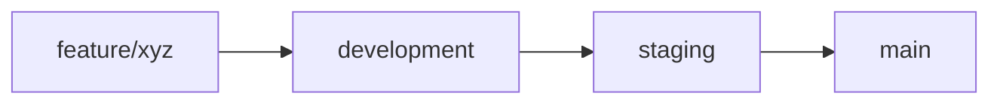

# Branch Protection Rules - Juan Heart Web Application

## Repository Information
**Repository**: johnrobertdelinila/juan-heart-web
**GitHub URL**: https://github.com/johnrobertdelinila/juan-heart-web

---

## Branch Strategy

### Protected Branches

#### 1. `main` Branch (Production)
**Protection Rules:**
- ✅ Require pull request reviews before merging (minimum 2 approvals)
- ✅ Require status checks to pass before merging
- ✅ Require branches to be up to date before merging
- ✅ Require conversation resolution before merging
- ✅ Require signed commits
- ✅ Require linear history
- ✅ Include administrators in restrictions
- ✅ Restrict who can push to matching branches (Only: Maintainers, Release Managers)
- ✅ Allow force pushes: NO
- ✅ Allow deletions: NO

**Required Status Checks:**
- `backend-tests` - PHPUnit/Pest tests pass
- `frontend-tests` - Jest tests pass
- `backend-lint` - PHP CS Fixer / Laravel Pint
- `frontend-lint` - ESLint checks pass
- `typescript-check` - TypeScript compilation successful
- `security-scan` - Security vulnerability scan passed
- `build-backend` - Laravel build successful
- `build-frontend` - Next.js build successful

#### 2. `staging` Branch (Pre-Production)
**Protection Rules:**
- ✅ Require pull request reviews before merging (minimum 1 approval)
- ✅ Require status checks to pass before merging
- ✅ Require branches to be up to date before merging
- ✅ Require conversation resolution before merging
- ✅ Restrict who can push to matching branches (Only: Developers, QA Team)
- ✅ Allow force pushes: NO
- ✅ Allow deletions: NO

**Required Status Checks:**
- `backend-tests`
- `frontend-tests`
- `backend-lint`
- `frontend-lint`
- `typescript-check`

#### 3. `development` Branch (Integration)
**Protection Rules:**
- ✅ Require pull request reviews before merging (minimum 1 approval)
- ✅ Require status checks to pass before merging
- ✅ Allow force pushes: NO
- ✅ Allow deletions: NO

**Required Status Checks:**
- `backend-tests`
- `frontend-tests`
- `backend-lint`
- `frontend-lint`

---

## Branch Workflow

### Feature Development Flow



### Branch Naming Conventions

#### Feature Branches
- `feature/assessment-validation` - New features
- `feature/referral-system` - Major feature implementation
- Merge into: `development`

#### Bugfix Branches
- `bugfix/login-redirect` - Bug fixes
- `bugfix/api-response-error` - Error corrections
- Merge into: `development` or `staging` (depending on severity)

#### Hotfix Branches
- `hotfix/security-patch` - Critical production fixes
- `hotfix/data-leak` - Emergency fixes
- Merge into: `main` AND back-merge to `staging` and `development`

#### Release Branches
- `release/v1.0.0` - Release preparation
- `release/v1.1.0` - Version releases
- Merge into: `main` (then tag) AND `development`

#### Documentation Branches
- `docs/api-documentation` - Documentation updates
- `docs/user-manual` - User guides
- Merge into: `development`

#### Chore/Maintenance Branches
- `chore/dependency-update` - Dependency updates
- `chore/code-cleanup` - Code maintenance
- Merge into: `development`

---

## Setting Up Branch Protection (Manual Steps)

### For Repository Administrators

**Step 1: Navigate to Settings**
1. Go to https://github.com/johnrobertdelinila/juan-heart-web
2. Click on **Settings** tab
3. Click on **Branches** in the left sidebar

**Step 2: Add Branch Protection Rule for `main`**
1. Click **Add branch protection rule**
2. Enter branch name pattern: `main`
3. Configure the following settings:

   **Protect matching branches:**
   - ☑ Require a pull request before merging
     - ☑ Require approvals: `2`
     - ☑ Dismiss stale pull request approvals when new commits are pushed
     - ☑ Require review from Code Owners

   - ☑ Require status checks to pass before merging
     - ☑ Require branches to be up to date before merging
     - Add status checks:
       - `backend-tests`
       - `frontend-tests`
       - `backend-lint`
       - `frontend-lint`
       - `typescript-check`
       - `security-scan`
       - `build-backend`
       - `build-frontend`

   - ☑ Require conversation resolution before merging
   - ☑ Require signed commits
   - ☑ Require linear history
   - ☑ Require deployments to succeed before merging (Select: `production`)

   **Rules applied to everyone including administrators:**
   - ☑ Include administrators

   **Restrict who can push to matching branches:**
   - ☑ Enable
   - Add: Repository maintainers only

   **Additional settings:**
   - ☑ Do not allow bypassing the above settings
   - ☑ Do not allow force pushes
   - ☑ Do not allow deletions

4. Click **Create** or **Save changes**

**Step 3: Repeat for `staging` and `development` branches**
- Follow the same steps but adjust the protection levels as specified above

---

## Code Owners

Create a `.github/CODEOWNERS` file to automatically request reviews from specific teams:

```
# Backend code
/backend/**                 @johnrobertdelinila @backend-team
/backend/app/Models/**      @johnrobertdelinila @backend-team @database-team
/backend/database/**        @johnrobertdelinila @database-team

# Frontend code
/frontend/**                @johnrobertdelinila @frontend-team
/frontend/src/app/**        @johnrobertdelinila @frontend-team
/frontend/src/components/** @johnrobertdelinila @frontend-team @ui-team

# Infrastructure & DevOps
/.github/workflows/**       @johnrobertdelinila @devops-team
/docker-compose.yml         @johnrobertdelinila @devops-team
/Dockerfile.*               @johnrobertdelinila @devops-team

# Documentation
/docs/**                    @johnrobertdelinila @documentation-team
*.md                        @johnrobertdelinila @documentation-team

# Configuration
/.env.*                     @johnrobertdelinila @devops-team
/backend/config/**          @johnrobertdelinila @backend-team @devops-team
```

---

## Pull Request Template

The PR template is located at `.github/pull_request_template.md` and will be used for all PRs.

---

## Commit Message Convention

We follow the **Conventional Commits** specification:

```
<type>(<scope>): <subject>

<body>

<footer>
```

### Types:
- `feat`: New feature
- `fix`: Bug fix
- `docs`: Documentation changes
- `style`: Code style changes (formatting, missing semi-colons, etc.)
- `refactor`: Code refactoring without changing functionality
- `perf`: Performance improvements
- `test`: Adding or updating tests
- `chore`: Maintenance tasks (dependency updates, etc.)
- `ci`: CI/CD configuration changes
- `build`: Build system changes

### Examples:

```bash
feat(auth): implement multi-factor authentication with SMS OTP

Added MFA support using Twilio SMS service. Users can now
enable 2FA in their security settings.

Closes #123
```

```bash
fix(api): resolve assessment validation error

Fixed issue where assessment validation was failing due to
incorrect date format parsing.

Fixes #456
```

---

## Security Policies

### Dependabot Configuration
Automated dependency updates are enabled via `.github/dependabot.yml`

### Secret Scanning
- GitHub secret scanning is enabled
- Never commit `.env` files
- Use GitHub Secrets for CI/CD credentials

### Code Scanning (CodeQL)
- Automated code scanning is enabled via GitHub Actions
- Scans run on every push and PR to protected branches

---

## Enforcement

### Pre-commit Hooks
Install Husky to enforce rules locally:

```bash
# In frontend directory
npm install --save-dev husky lint-staged
npx husky install

# In backend directory
composer require --dev brainmaestro/composer-git-hooks
composer cghooks add --git-hook=pre-commit
```

### Pre-push Hooks
Prevent pushing to protected branches directly:

```bash
# .husky/pre-push
#!/bin/sh
. "$(dirname "$0")/_/husky.sh"

protected_branches=('main' 'staging')
current_branch=$(git symbolic-ref HEAD | sed -e 's,.*/\(.*\),\1,')

for branch in "${protected_branches[@]}"
do
  if [ $branch = $current_branch ]; then
    echo "Direct push to $current_branch is not allowed. Please create a pull request."
    exit 1
  fi
done
```

---

## Review Guidelines

### Reviewer Checklist

Before approving a PR, reviewers should verify:

- [ ] Code follows project coding standards
- [ ] All tests pass
- [ ] No security vulnerabilities introduced
- [ ] Documentation is updated
- [ ] No sensitive data in commits
- [ ] Commit messages follow convention
- [ ] Breaking changes are documented
- [ ] Performance implications considered
- [ ] Accessibility requirements met (frontend)
- [ ] Mobile responsiveness verified (frontend)
- [ ] Database migrations are reversible (backend)
- [ ] API changes are backward compatible (backend)

---

## Monitoring

### Branch Health Metrics
Monitor the following:
- Average PR merge time (Target: < 24 hours)
- PR approval rate (Target: > 95%)
- Build success rate (Target: > 90%)
- Test coverage (Target: > 80%)
- Security scan pass rate (Target: 100%)

---

**Last Updated**: October 21, 2025
**Document Owner**: DevOps Team
**Review Cycle**: Monthly
